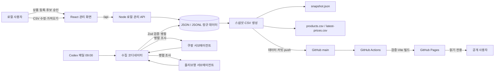
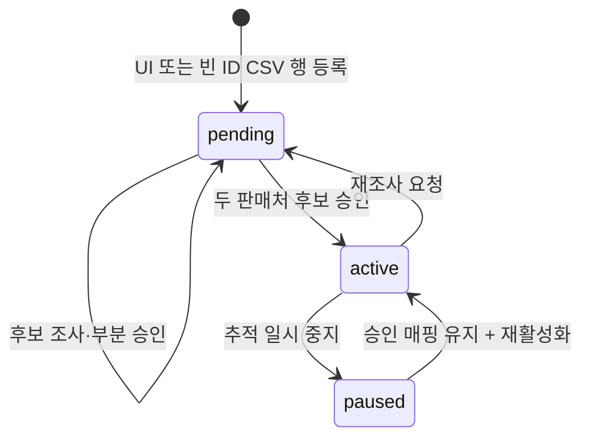
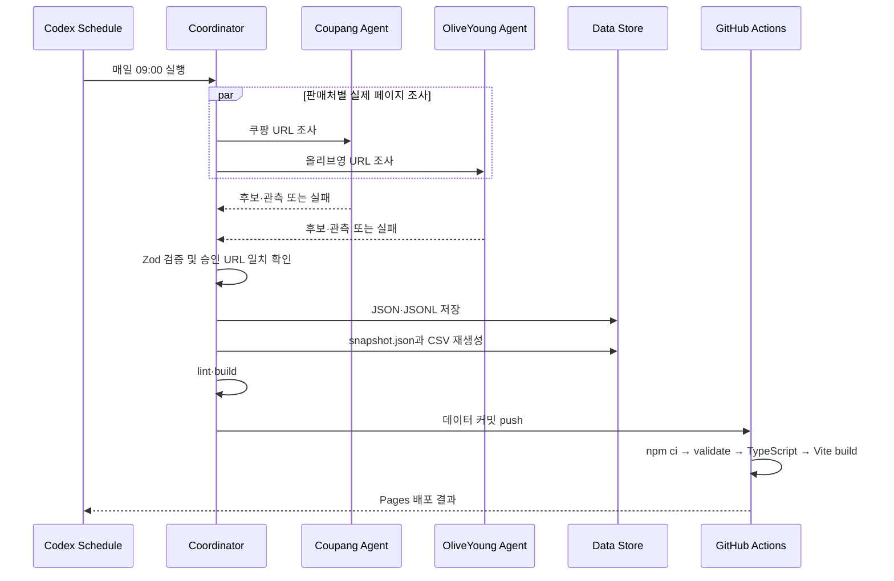

# 화장품 최저가 기록장 아키텍처

이 문서는 `cheap-product-looker`의 현재 구현 구조와 데이터 흐름을 설명한다. 이 프로젝트는 로컬에서 상품을 관리하고 실제 판매처 가격을 수집한 뒤, GitHub Pages에서 검증된 비교 결과를 읽기 전용으로 공개한다.

## 핵심 원칙

- 가격, 배송비, 재고와 상품 후보는 쿠팡·올리브영의 실제 공개 페이지에서 확인한 값만 저장한다.
- Mock, fixture, 예시 가격과 추정값을 운영 및 검증 데이터로 사용하지 않는다.
- 상품 후보는 자동 승인하지 않는다. 사용자가 판매처별 URL을 승인한 상품만 가격을 추적한다.
- JSON·JSONL을 정규 데이터로 사용하고 CSV와 공개 스냅샷은 정규 데이터에서 생성한다.
- GitHub Pages는 읽기 전용이다. 쓰기 기능은 `127.0.0.1`에 바인딩된 로컬 관리 서버에서만 제공한다.
- 한 판매처의 수집 실패가 다른 판매처의 정상 결과 저장을 막지 않는다.

## 시스템 구성



## 런타임 경계

### 공개 SPA

- 위치: `web/src`
- 기술: React, TypeScript, Vite
- 배포 경로: `/cheap-product-looker/`
- 라우팅: 해시 라우팅
  - `#/`: 가격 비교 보드
  - `#/product/:id`: 상품별 가격 이력
  - `#/admin`: 공개 환경에서는 읽기 전용 안내
- 데이터 입력: `web/public/data/snapshot.json`
- CSV 다운로드: `products.csv`, `latest-prices.csv`

공개 SPA에는 쓰기 권한이나 저장소 자격 증명이 없다. 브라우저는 배포된 정적 파일만 읽는다.

### 로컬 관리 서버

- 위치: `web/server/index.ts`
- 바인딩: `127.0.0.1:4174`
- 개발 UI: `127.0.0.1:5173`
- 역할:
  - 조사 대기 상품 등록
  - 후보 승인·거절
  - 재조사 요청
  - 상품 상태 변경
  - 상품 CSV 검증 및 가져오기

Vite 개발 서버는 `/api` 요청만 로컬 관리 서버로 프록시한다. 외부 네트워크에 관리 API를 공개하는 구성은 지원하지 않는다.

### Codex 수집 작업

Codex 앱에 저장된 활성 스케줄이 매일 오전 9시(Asia/Seoul)에 실행된다. 스케줄 정의는 저장소 코드가 아니라 Codex 로컬 프로젝트 설정에 존재한다.

한 번의 실행은 정확히 두 서브에이전트를 병렬로 사용한다.

1. 쿠팡 에이전트가 승인된 쿠팡 URL과 조사 대기 상품을 확인한다.
2. 올리브영 에이전트가 승인된 올리브영 URL과 조사 대기 상품을 확인한다.
3. 코디네이터가 두 결과를 병합하고 `collectorPayloadSchema`로 검증한다.
4. `web/server/import-run.ts`가 검증된 후보·관측·실행 결과만 저장한다.
5. lint와 프로덕션 빌드가 성공하면 데이터 파일만 커밋해 `main`에 push한다.

서브에이전트는 파일을 수정하지 않으며 로그인, CAPTCHA 또는 접근 차단을 우회하지 않는다. 상세 계약은 `docs/collector-contract.md`에 정의한다.

## 데이터 아키텍처

### 정규 데이터

| 파일 | 형식 | 역할 | 쓰기 방식 |
|---|---|---|---|
| `sources.json` | JSON | 판매처 ID, 표시명, 허용 호스트 | 수동 관리 |
| `products.json` | JSON | 상품 정보, 상태, 승인된 판매처 매핑 | 관리 API·CSV 가져오기 |
| `candidates.json` | JSON | 실제 상품 후보와 승인 상태 | 수집 가져오기·관리 API |
| `observations.jsonl` | JSONL | 가격 관측 이력 | 논리적 append-only |
| `runs.jsonl` | JSONL | 수집 실행과 배포 상태 | 논리적 append-only |

모든 정규 데이터는 `web/src/lib/schema.ts`의 Zod 스키마를 통과해야 한다. 파일 갱신은 임시 파일을 쓴 뒤 rename하는 방식으로 수행해 부분 쓰기를 방지한다.

### 파생 데이터

| 파일 | 생성 기준 | 용도 |
|---|---|---|
| `snapshot.json` | 정규 데이터 전체 | 공개 SPA가 읽는 최적화된 뷰 |
| `products.csv` | `products.json` | 엑셀 기반 상품 확인·일괄 수정 |
| `latest-prices.csv` | `snapshot.json` | 판매처별 최신 가격 다운로드 |

`products.csv`는 관리 편의를 위한 양방향 투영이다. CSV를 가져오면 다음 규칙을 적용한 후 `products.json`을 다시 생성한다.

- 기존 상품은 ID로 식별하고 브랜드·상품명·용량·구성·상태만 갱신한다.
- 판매처 URL 열은 확인용이며 CSV 가져오기로 승인 매핑을 만들거나 변경하지 않는다.
- ID가 빈 새 행은 새 UUID를 발급하고 항상 `pending` 상태로 생성한다.
- CSV에서 빠진 기존 상품은 삭제하지 않고 보존한다.
- 두 판매처 매핑이 모두 승인되지 않은 상품은 `active`로 변경할 수 없다.

`latest-prices.csv`는 출력 전용이다. 가격을 CSV에 직접 입력하거나 이를 가격 원본으로 가져오는 경로는 없다.

## 데이터 모델

### Product

표준 상품 정보와 상태, 판매처별 승인 매핑을 가진다.

- 상태: `pending` → `active` 또는 `paused`
- `active` 조건: 쿠팡과 올리브영 매핑이 모두 승인됨
- 판매처 매핑: 승인 URL, 실제 페이지 제목, 판매자, 구성, 승인 시각

### MarketCandidate

에이전트가 실제 페이지에서 발견한 승인 전 후보다. URL, 실제 제목, 판매자, 구성, 동일상품 판단 근거, 근거 수준과 발견 시각을 포함한다.

### PriceObservation

한 상품·판매처·수집 실행 조합의 가격 관측이다. 상품가, 필수 배송비, 총액, 비교 가능 여부, 재고, 판매자, 조건부 혜택, 수집 시각과 원본 URL을 포함한다.

### CollectionRun

수집 작업의 시작·종료 시각, 판매처별 성공·실패, 검증 오류와 배포 상태를 기록한다.

## 가격 비교 규칙

일반 비회원에게 공개된 상품가와 필수 배송비만 총액에 포함한다.

- `totalPrice = productPrice + shippingFee`
- 배송비를 확정할 수 없으면 `shippingFee`와 `totalPrice`는 `null`, `comparable`은 `false`다.
- 품절 또는 재고 불명 상태는 최저가 판정에서 제외한다.
- 승인된 용량·색상·세트 구성과 다른 관측은 저장하지 않는다.
- 카드, 쿠폰, 와우, CJ ONE 등 조건부 혜택은 `benefitNote`에만 기록한다.
- 수집 후 36시간 이내이며 재고 있음·비교 가능 상태인 최신 관측만 최저가 판정에 사용한다.
- 오래된 마지막 성공 가격은 화면에 남기되 `stale`로 표시한다.

## 주요 처리 흐름

### 상품 등록과 승인



### 가격 수집과 게시



## 검증 계층

1. 입력 검증: API 및 CSV 입력을 Zod로 검증한다.
2. 관계 검증: 후보·관측의 상품 ID와 실행 ID가 실제 정규 데이터에 존재하는지 확인한다.
3. URL 검증: 판매처 허용 호스트와 승인 상품 URL이 관측 URL에 일치하는지 확인한다.
4. 가격 불변식 검증: 배송비·총액·재고·비교 가능 상태 조합을 검사한다.
5. 파생 데이터 검증: 스냅샷 집계와 CSV가 정규 데이터에서 다시 계산한 결과와 일치하는지 검사한다.
6. 빌드 검증: ESLint, TypeScript와 Vite 프로덕션 빌드를 실행한다.

외부 사이트 상태 때문에 라이브 수집이 실패하면 실패를 실행 이력에 기록한다. 가짜 성공값으로 대체하지 않는다.

## 배포

`.github/workflows/deploy-pages.yml`은 `main`의 `web/**` 변경에 반응한다.

1. 저장소 checkout
2. Node 설치 및 `npm ci`
3. `npm run build`
   - 실제 저장 데이터 검증
   - TypeScript 검사
   - Vite 빌드
4. `web/dist`를 Pages artifact로 업로드
5. GitHub Pages 배포

동시 배포는 `pages` 그룹에서 직전 실행을 취소하는 방식으로 직렬화한다. 가격 수집 스케줄은 GitHub Actions에 두지 않는다.

## 디렉터리 책임

```text
cheap-product-looker/
├─ .github/workflows/       GitHub Pages 배포
├─ docs/                    수집 계약
├─ web/
│  ├─ public/data/          정규 데이터와 공개 파생 데이터
│  ├─ server/               로컬 API, 저장소, CSV, 수집 가져오기
│  ├─ src/lib/schema.ts     공유 데이터 계약
│  ├─ src/App.tsx           공개·관리 UI
│  ├─ src/styles.css        반응형 스타일
│  └─ vite.config.ts        Pages base와 로컬 API 프록시
├─ ARCHITECTURE.md          현재 문서
└─ README.md                실행 및 운영 안내
```

## 변경 시 지켜야 할 경계

- 새 필드를 추가하면 Zod 스키마, 저장 로직, 스냅샷, CSV와 검증 코드를 함께 변경한다.
- 가격 원본은 `observations.jsonl`에만 추가한다. `snapshot.json`과 CSV를 직접 편집하지 않는다.
- 판매처를 추가하려면 `SourceId`, 데이터 스키마, 수집 에이전트 구성, UI와 비교 로직을 동시에 확장해야 한다.
- 공개 SPA에 쓰기 API나 저장소 토큰을 넣지 않는다.
- 스케줄의 데이터 stage 범위는 `web/public/data`로 제한하고 force push를 사용하지 않는다.
